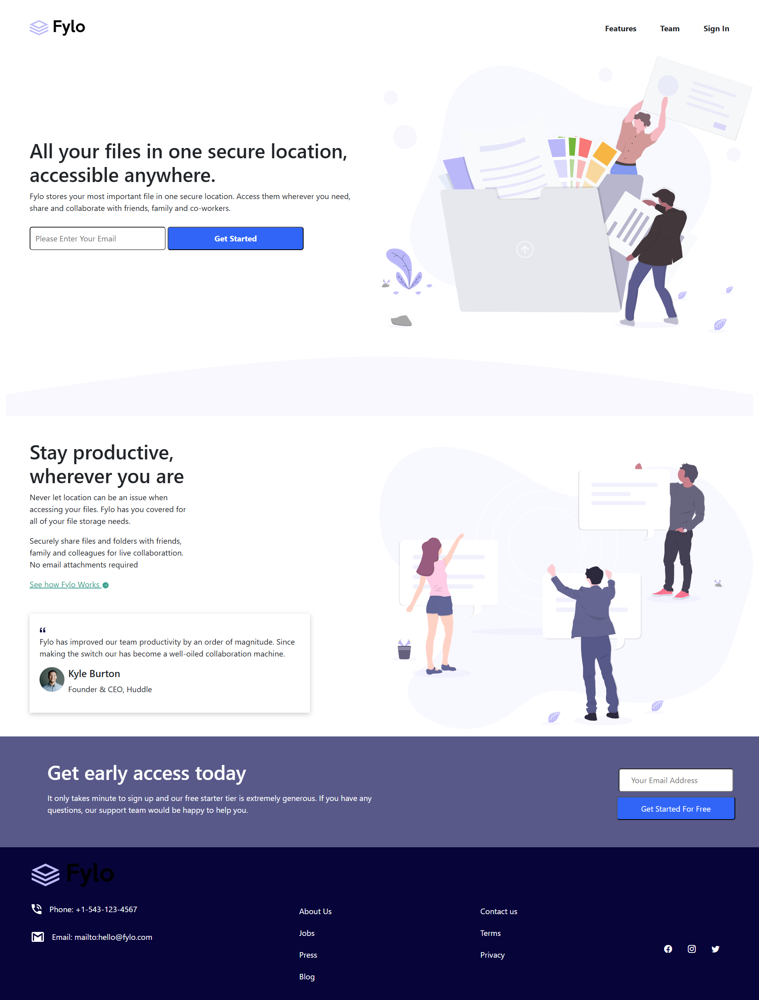
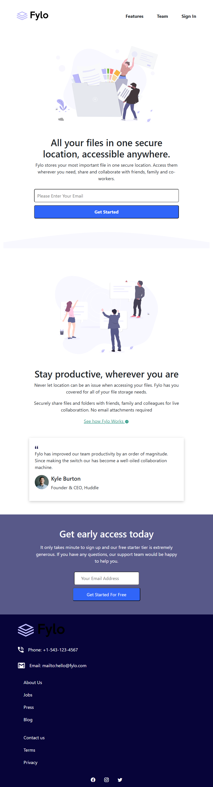
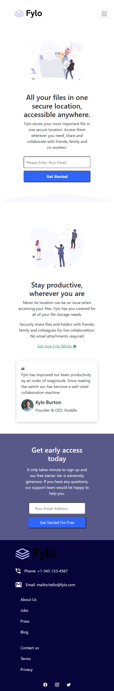

# **Fylo Landing Page with Two-Column Layout**



## **Table of Contents**
1. [Overview](#overview)
2. [Features](#features)
3. [Technologies Used](#technologies-used)
4. [Demo](#demo)
5. [Screenshots](#screenshots)
6. [Installation and Usage](#installation-and-usage)
7. [Folder Structure](#folder-structure)
8. [Learnings](#learnings)
9. [Future Improvements](#future-improvements)
10. [Acknowledgments](#acknowledgments)
11. [Feedback](#feedback)

---

## **Overview**

This project is a solution to the **Frontend Mentor - Fylo Landing Page with Two-Column Layout Challenge**. It is a static and responsive landing page designed to work seamlessly on both desktop and mobile devices.

The objective was to replicate the given design as closely as possible using **HTML**, **CSS**, and **Bootstrap**, focusing on responsiveness and user experience. The page showcases:
- Two-column layout for content organization.
- A fully responsive design with media query optimizations for different screen sizes.
- Hover effects for interactivity.

---

## **Features**

- 📱 **Responsive Design**: Adapts to different screen sizes, including desktop, tablet, and mobile.
- 🎨 **Custom Styling**: Styled with CSS and enhanced with Bootstrap for consistent and professional visuals.
- 🖱️ **Interactive Hover States**: Highlights interactive elements for improved user experience.
- 🖼️ **Optimized Images**: All assets are optimized for fast loading.
- 📐 **Pixel-Perfect Layout**: Matches the design specifications provided in the challenge.
- 🔀 **Cross-Browser Compatibility**: Tested to work seamlessly on major browsers like Chrome, Firefox, and Edge.

---

## **Technologies Used**

### Languages:
- **HTML5**: Semantic markup and structure.
- **CSS3**: Styling and layout creation.
- **Bootstrap**: Responsive grid system and pre-designed components.

### Tools:
- **VS Code**: Development environment.
- **Git**: Version control.
- **GitHub Pages**: For hosting the live demo.

---

## **Demo**

🔗 [Live Demo on GitHub Pages](#)  
(https://fylo-pj.netlify.app/)

---

## **Screenshots**

### Desktop View


### Tablet View


### Mobile View


---

## **Installation and Usage**

### Prerequisites
To view the project locally, you’ll need:
- A web browser (e.g., Chrome, Firefox)
- A code editor (optional, for inspecting/editing code)

### Steps:
1. Clone the repository:
   ```bash
   git clone https://github.com/yourusername/fylo-landing-page.git
   ```
2. Navigate to the project folder:
   ```bash
   cd fylo-landing-page
   ```
3. Open `index.html` in your browser to view the landing page.

---

## **Folder Structure**

```
Fylo Landing Page/
│
├── design/            # Design previews (desktop, mobile)
├── images/            # Image assets (optimized)
├── index.html         # Main HTML file
├── index.css         # Custom CSS styles
├── README.md          # Project documentation
├── style-guide.md     # Design guidelines (colors, typography)
└── .gitattributes     # GitHub linguist language detection
```

---

## **Learnings**

This project helped me gain deeper insights into:
- 📏 **Responsive Design**: Creating layouts that adapt across devices using **media queries**.
- 🎯 **Bootstrap Framework**: Leveraging the grid system and utility classes for faster development.
- 🎨 **CSS Styling**: Writing clean, reusable styles for hover effects, typography, and layouts.
- 🚀 **Static Hosting**: Deploying a static site using GitHub Pages.

---

## **Future Improvements**

In future iterations, I aim to:
1. Add **CSS animations** to enhance visual interactivity.
2. Improve **accessibility** by ensuring compatibility with screen readers and ARIA attributes.
3. Implement **JavaScript** for interactive elements like form validation or dynamic content.
4. Optimize the layout further for faster loading on mobile devices.

---

## **Acknowledgments**

- Thanks to [Frontend Mentor](https://www.frontendmentor.io) for providing this challenge and design inspiration.
- Kudos to the **Frontend Mentor Community** for feedback and support during the development process.

---

## **Feedback**

I’d love to hear your thoughts and suggestions about this project!  
Feel free to:
- **Raise an issue** in this repository.
- **Connect with me** on [LinkedIn](https://www.linkedin.com/in/sai-chandu-a-454a9a126/).
- Drop me an email at **saichanduallamgari@gmail.com**.

---

## **License**

This project is licensed under the MIT License. You’re free to use and modify it as long as you credit the original author.

---

This detailed `README.md` file ensures your skills, process, and the quality of your work are communicated effectively. Let me know if you need further customization! 🚀